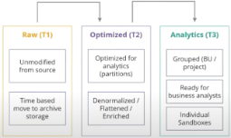

# Data Lake

The data once stored in the data warehouses are still not usable for the decision making process, this data are called **Dark Data**. Most of them will never be used, it is estimed that most of them are useless and another part is redundant, thougth only a small part of these data is *Business-critial*.

## What is a Data Lake?
A repository of data stored in its raw format, still not cleaned. So a data lake is a structure where all the files that do not have a precise use are accumulated in order to wait for processing.

# Traditional Data Analytics Architecture vs. Modern Data Lakes

## 1. Siloed Departmental Data
- **Traditional Approach**: Data is stored in isolated systems specific to departments (e.g., sales, finance, marketing). This leads to fragmented data that is difficult to consolidate and analyze across the organization.
- **Problem**: Limits cross-functional data insights and creates bottlenecks for organization-wide analytics.
- **Modern Approach**: Data lakes store all data from different departments in a centralized repository, making it easier to break down silos and perform organization-wide analysis.

## 2. Enterprise Data Warehouse (EDW) with Long Implementation Cycles
- **Traditional Approach**: Implementing an Enterprise Data Warehouse (EDW) requires significant planning, integration of data sources, ETL (Extract, Transform, Load) processes, and upfront schema definition.
- **Problem**: Long and expensive implementation cycles; difficulty adapting to changing business needs.
- **Modern Approach**: Data lakes allow quick ingestion of raw data without extensive preprocessing. Schema and transformations are applied when needed (schema-on-read), resulting in faster implementation and adaptability to changing requirements.

## 3. Limits of Scalability and High Costs
- **Traditional Approach**: Scaling traditional databases and data warehouses can be expensive, as both storage and compute capacity must be upgraded together.
- **Problem**: High cost and lack of flexibility when scaling infrastructure.
- **Modern Approach**: Data lakes (especially cloud-based) provide highly scalable storage at a low cost, with the ability to scale compute resources independently of storage.

## 4. Compute and Storage Have to be Scaled Together
- **Traditional Approach**: In a traditional EDW, compute and storage are tightly coupled, meaning you need to increase both even if only one is required.
- **Problem**: Lack of flexibility and cost-efficiency.
- **Modern Approach**: Data lakes decouple storage from compute, allowing organizations to scale them separately based on specific needs.

## 5. Lack of Support for Unstructured Data
- **Traditional Approach**: Traditional databases are optimized for structured data (e.g., tables and columns), making it difficult to handle unstructured or semi-structured data (e.g., images, logs, videos).
- **Problem**: Limited ability to work with diverse data types.
- **Modern Approach**: Data lakes handle all types of data—structured, semi-structured, and unstructured—providing greater flexibility and better data utilization.

## 6. Machine Learning (ML) and Data Science (DS) Workloads
- **Traditional Approach**: Traditional data analytics platforms are not optimized for machine learning and data science workloads, which require access to large amounts of raw data.
- **Problem**: Limited support for modern data science tools, requiring specialized environments that are difficult to integrate.
- **Modern Approach**: Data lakes are better suited for ML/DS workloads, storing raw data for feature engineering, model training, and experimentation.

## 7. Ad-hoc Analytical Queries
- **Traditional Approach**: Data warehouses are often optimized for predefined, structured queries, making ad-hoc queries slow or inefficient.
- **Problem**: Difficulty running fast, ad-hoc queries common in exploratory analysis and data discovery.
- **Modern Approach**: Data lakes provide access to raw data for analysis, allowing users to run ad-hoc queries on large datasets using modern analytics engines (e.g., Apache Spark, Presto, Athena).

## Requiremnts
The main requirements for this approach are:
- Wide range of analytics use cases
- Data in hands of the business users
- Flexible and scalable data architecture
- Short Time to value
- Holistic metadata managment, governance, security monitoring and usage analytics

# Features and Use Cases of Data Technologies

| **Use Cases**                                      | **Tech Solutions**      | **Feature Trends**                                         |
|----------------------------------------------------|-------------------------|------------------------------------------------------------|
| **Mission-critical, low latency, insight apps**    | Data Warehouse / Hot     | - More expensive HW/SW  - Use case-specific data  - Low latency  - More governance  - Higher data quality  - Used by end-users and data analysts |
| **Agile insight apps**                             | Data Hub / Warm          | - Balances cost and performance  - Agile insight generation for quick decision making |
| **Staging area, data mining, searching, profiling, cataloging** | Data Lake / Cold         | - Less expensive HW/SW  - All enterprise data  - Higher latency  - Less governance  - Lower data quality  - Used by data scientists |

# Detailed Requirements: Traditional Data Systems vs Insight-Driven Systems

| **Aspect**                        | **Traditional Data Systems**                                      | **Insight-Driven Systems**                                                |
|-----------------------------------|-------------------------------------------------------------------|----------------------------------------------------------------------------|
| **Data Sources**                  | - Structured, relational data from transaction systems  - Relational and operational data stores | - Traditional sources  - Semi and unstructured sources: logs, websites, social media, alternative data providers |
| **Data Movement (Ingestion)**     | - Amount of data that could be moved is limited                   | - Virtually unlimited amount of data that could be moved into the system in original form at a required latency |
| **Storage**                       | - Limited volume of stored data                                   | - Unlimited volume of data. Source of truth for all source data              |
| **Data Structure**                | - Schema is designed upfront, before data is captured  - Data format dictated by storage/technology | - Schema is not fixed when data is captured  - Variety of supported open formats for analytics pipelines (relational, document, graph, etc.) |
| **Data Transformations**          | - Upfront, time-consuming data cleansing, enrichment, integration, and transformation  - “Single source of truth” of trusted and widely usable data | - Add transformation for ad-hoc data querying and data science related feature engineering |
| **Analytics**                    | - SQL Queries  - BI tools  - Full text search              | - Self-service BI  - Big data analytics  - Real-time analytics  - Machine learning  - Data exploration/visualization  - Allow users to securely explore and query raw data  - Easily introduce new types of analytics |
| **Price/Performance**            | - Highest cost storage  - Fastest query results                | - Low-cost storage  - Performance scale/speed/cost tradeoffs             |
| **Users**                        | - Business (analysts)                                            | - Data Scientists  - Data analysts and engineers  - Developers         |
| **Data Quality**                 | - High                                                            | - Low and high, depending on use case  - Data quality must be transparent |
| **Data Sharing and Collaboration**| - Very limited  - Mainly via central DW/BI team                | - Rich sharing  - Raw and transformed data sets  - Analytical models  - Dashboards can be easily and securely shared |

## Type of users in Data Lake

- **Business Users**: use a pre-configured dashboard and report
- **Business Analyst**:use a self-service BI and ad-hoc analytics, built own models to provide business insigth
- **Data Scientist, Engineering, App Dev**: perform statistical analysis and ML training, implement big data analytics to identify trends, solve business problems, optimize performance.

# Data Lake Components

## Data Ingestion
Data ingestion is the process of collecting and importing data from various sources into a database or storage system for further processing and analysis. The goal is to clean and store data in a consistent and accessible central repository.

To manage this data is possible also to use tools which do not imply using code.

### No Code tools for data managment

This tools do not neeed to code, instead all the commands are sended by graphical interface.

The best practice for data ingestion are: 
- Identify the business case
- Identify the rigth method of ingestion 
- Consider the streaming and CDC(Change Data Capture) ingestion benefits
- Focus on the near terms
- Compress the data before sending them
- Encrypt the personally identifiable information
- Reduce the number of files
- Ensure the exact process
- Automate the ingestion

# Storage Managment
The storage is divided into three *Zones*. 

- **Raw**: This is the immutable storage, it cannot/should not be changed, it is useful for disaster recovery
- **Optimized**: as the raw data grow, retrive them directly becomes slower and to gain speed they can be convertend into optimized formats
- **Analytics**: This are data ready to be used by engineering for BI and Machine-learning goals.

The most used and optimized formats in the open source communiti are:

The data should be kept in an homogeneus data format within a block.
It is possible to apply strategies to compress the data in a block.
This is why most of the time we focus on columnar storages where the mining is performed on columns to speed up the process. Most of the times the OLTP uses a row-wise format to send the transaction.

# Data Processing and Analytics
The data analytics is based on three different type of tecnique:

- **Interactive Analytics**: where a lot of data are requested for creating an output.
- **Big Data Analytics**: Interactive queries to large volumes are also performed here, but the output is Data Aggregation, Data Transformation and Complex Data Analytics
- **Real-Time Analytics**: Here the goal is to obtain the event detection.

Furthermore is possible to use three differnt architecture for the Data Lake:

### Lambda Architecture
Here the purpouse is to handle both batch and real-time data processing.

### Kappa Architecture
Here the purpouse is to unify batch and streaming data processing.

### Delta Architecture
Simplifies data processing by using a single pipeline for both batch and real-time data.

Here we have many advantages and among them:
- ACID Transaction
- Scalabe Metadata Handling
- Data Versioning
- Unified Batch and Streaming Source and Sink
- Schema Enforcement
- Schema Evolution

The metadata are crucial for helping whoever use the data to discover and understand the data effectively. Also they ensure that the data lake remains a valuable resource by organizing and managing catalogs.

The data lake can be seen as the landing zone for all the data. They need to be secured with RBAC.

Data swapping should be avoided in order to maintain the dataset valuable.

